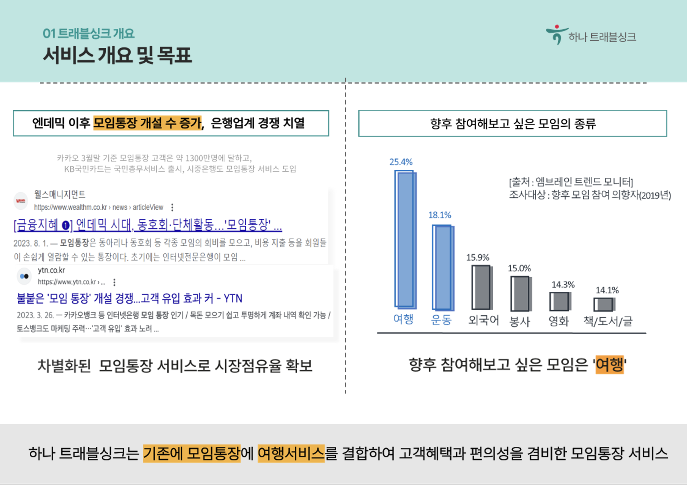
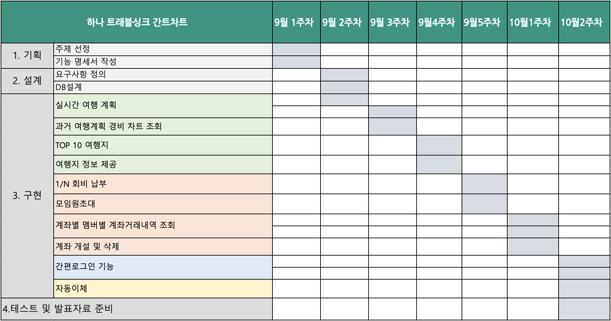
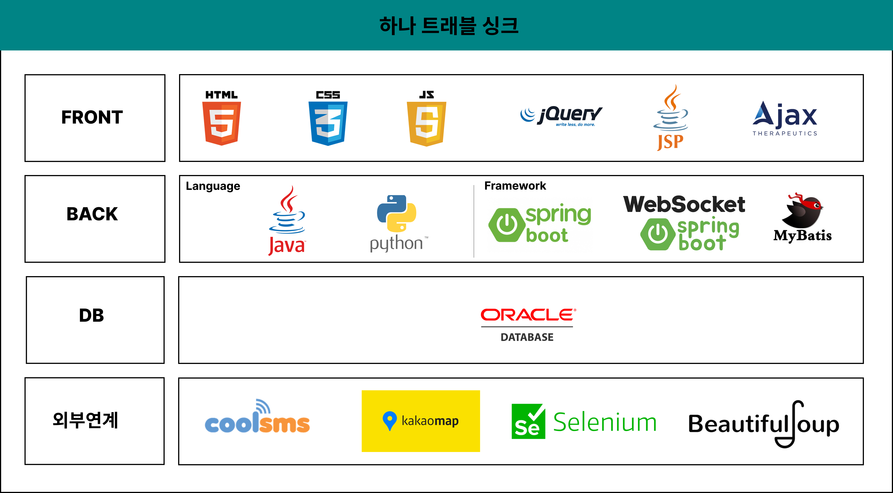
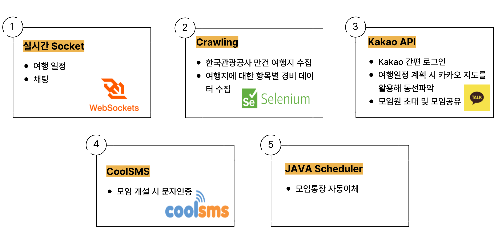
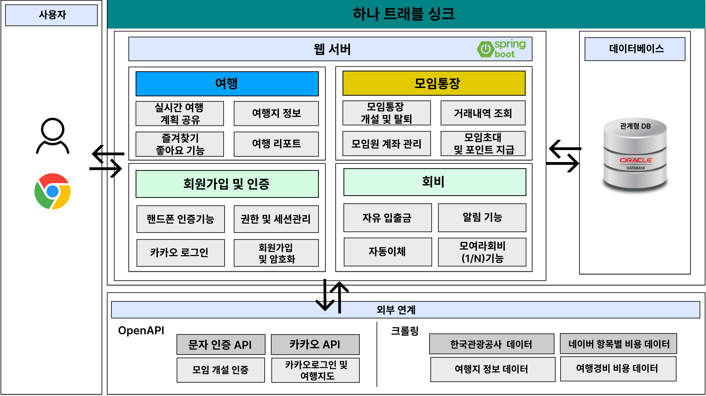
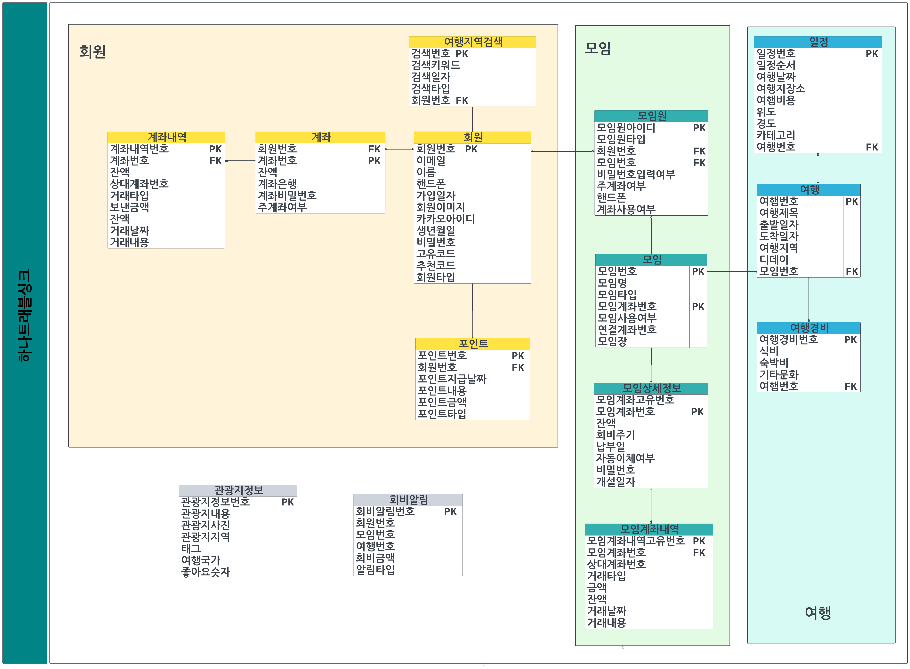
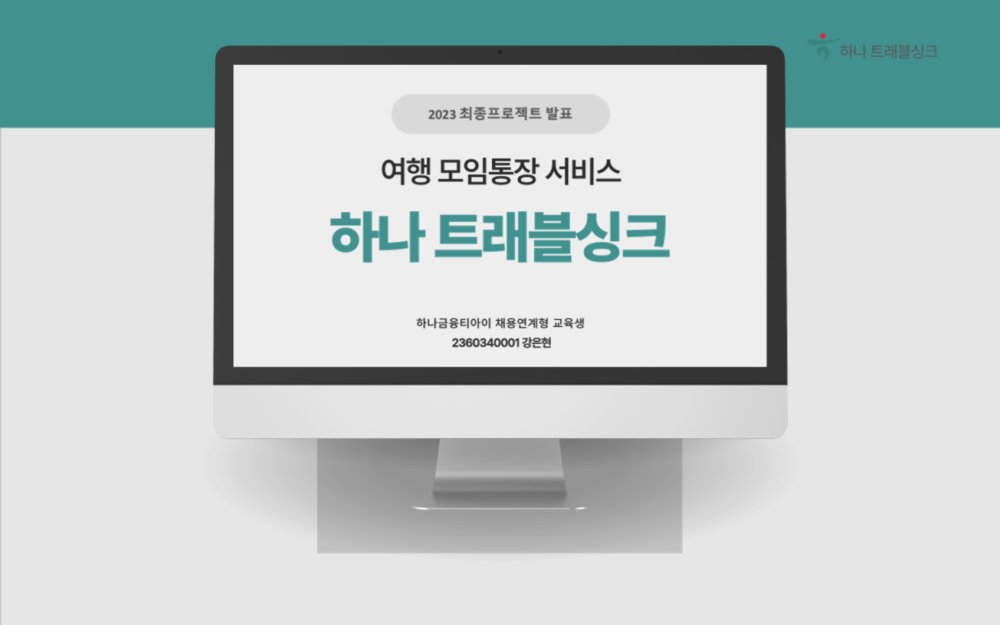
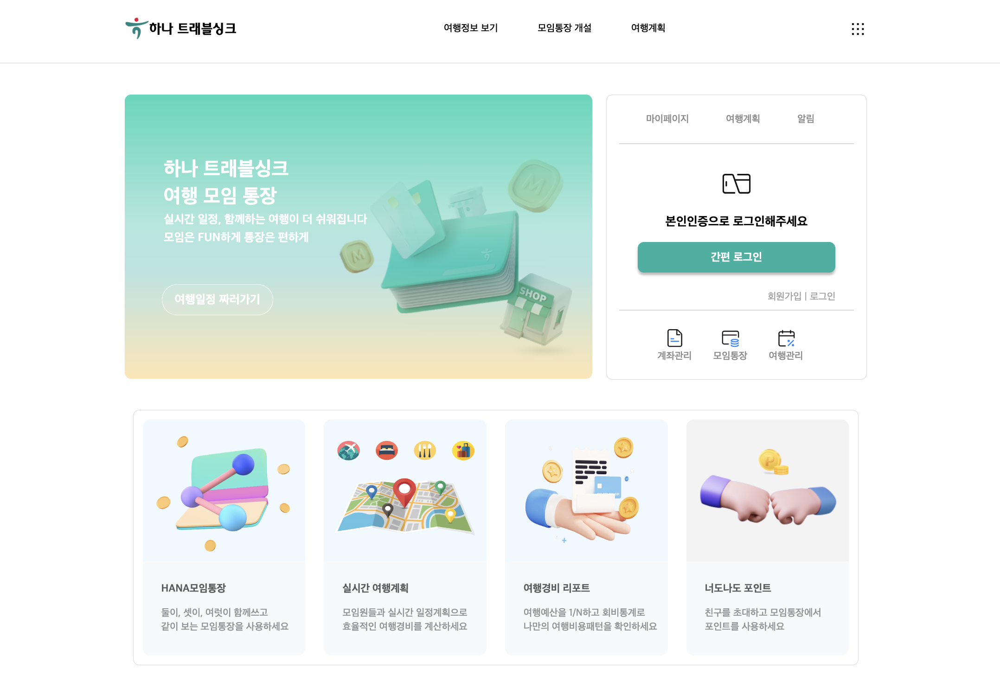

# 여행 모임통장 서비스 - 트래블싱크(TravelSync) 

# 1. 프로젝트 소개

### 1-1. 프로젝트 기획배경 및 목표

#### 1-1-1 기획배경
• 코로나19 엔데믹 이후, 모임통장 개설 수가 증가하고 있으며, 은행업계 모임통장 서비스 경쟁 치열<br/>
• 다양한 신규고객 확보를 위해 차별화된 모임통장 서비스 제공 필요.<br/>
• 은행 입장에선 모임통장을 통해 저원가성 예금을 유치하고 있으며, 예대금리차에 따른 이자이익이 증가하면서 수익증대에도 영향을 끼침.<br/>
• 향후 모임에 참여하고 싶은 분야 중 '여행'이 24.5%로 가장 높은 비중을 차지하고 있으며, 이에 착안하여 트래블싱크를 기획.<br/>

#### 1-1-2 목표
• 신규 고객 유입 증가 : 하나은행이 경쟁력 있는 모임통장 서비스를 제공하여 새로운 고객을 유입.<br/>
• 모임통장 개설 고객 수 증가 : 모임통장 멤버 중에서 계좌가 없는 멤버를 하나은행의 고객으로 전환시키는 비율을 높이는 것.<br/>
• 고객 경험 향상 : 모임통장 서비스를 활발하게 이용하도록 고객들에게 편의성과 혜택을 제공.<br/>

 <br/>

### 1-2. 개인적인 경험

• 여행 계획을 세울 때, 숙박, 식비, 문화 등 다양한 정보를 여러 다양한 플랫폼을 번갈아가며 사용해 계획을 세우는 데 시간이 오래 걸려서 불편함을 느낌.<br/>
• 모든 여행 관련 정보를 하나의 플랫폼에서 통합하여 빠르게 여행 일정을 세울 수 있도록 함.<br/>
• 친구들과 함께 실시간으로 여행 계획을 공유하고 모임통장과 결합하여 여행 경비를 공평하게 분담할 수 있도록 함. <br/>


### 1-3. 개발환경

```
OS : Mac
Framework : Spring Boot
Server : tomcat9
Tool : Eclipse, Sql Developer, Github
DBMS : Oracle DBMS
```

### 1-4. 수행기간

개발기간: 2022.09.01 - 2022.10.20 <br/>

 <br/>

# 2. 프로젝트 수행계획

### 2-1. 프로젝트 개요


• 트래블싱크는 모임통장과 여행서비스를 결합한 고객 혜택과 편의성을 제공하는 서비스.<br/>

- 여행 계획 :<br/>
  여행 모임원들이 실시간으로 여행 일정을 계획하고 관리할 수 있는 기능을 제공.<br/>
  사용자들은 여행 날짜, 목적지, 활동, 숙박, 식비 등의 세부 정보를 상세하게 기록하고, 다양한 여행 정보와 추천을 검색하여 일정에 추가. <br/>
  이를 통해 여행 계획을 더울 효율적으로 수립할 수 있음.<br/><br/>
- 모임통장 :<br/>
  모임장이 모임통장을 개설하고 그룹 멤버를 초대하며, 회비 규칙을 설정할 수 있는 기능을 제공.<br/>
  모임원들은 여행 일정을 함께 조정하고 수정할 수 있고, 모임통장 내에서 멤버별 및 계좌별 거래 내역을 조회하여 투명한 모임관리가 가능.<br/><br/>
- 회비 공유 : <br/>
  계획한 여행 경비를 기반으로 여행 경비를 공평하게 분담하고 관리하는 기능을 제공.<br/><br/>
- 고객 혜택 : <br/>
  사용자들에게 너도나도초대 이벤트를 통해 1000포인트 및 10원 이내 경비를 제공과 같은 다양한 혜택을 제공.<br/>


### 2-2. 시스템 아키텍처

 <br/>

### 2-3. 적용기술
• Spring MVC 기반 웹 어플리케이션 제작<br/>
• Scheduler를 이용한 모임통장 자동이체<br/>
• Web Socket을 활용한 실시간 여행 일정 공유 및 채팅<br/>
• Javascript 및 Jquery를 활용한 비동기 처리<br/>
• Kakao API, coolSMS API 활용한 간편 인증<br/>
• Selenium, BeautifulSoup을 활용하여 여행지,여행경비(식비,숙박비,문화 등) 크롤링<br/>
• Interceptor를 통한 일반회원 접근 페이지 분리<br/>

 <br/>

# 3. 프로젝트 구축 완료

### 3-1. 서비스 아키텍처

 <br/>


### 3-2. ERD

 <br/>

## 발표 ppt

[발표자료](/finalproject.pdf) <br/>


## 시연 동영상
 <a href="https://youtu.be/EX_0rZvv_CM"></a><br/>


# 4. 본인 소개

| 구분                           | 내용                                                                                          | 비고                                       |
| --------------------------   | --------------------------------------------------------------------------------------------- | ------------------------------------------ |
| 이름                          | 강은현                                                                                          |     |
| 연락처                         | keh0469@naver.com                                                                             |                                            |
| 학력사항                        | 세종대학교 소프트웨어학과 졸업                                                                        | 2021.02.19                                 |
| Frontend skill               | HTML, CSS, Javascript                                                                          |                                            |
| Backend skill                | Java, SpringBoot, Oracle                                                                       |                                            |
| 자격증                         | SQL개발자 (한국데이터산업진흥원)                                                                      | 2022.04.08                                 |
| 수상내역                       | 한국폴리텍대학 벤처창업아이템 경진대회 본선진출(**🥉동상확보**)                                                | 중소벤처기업부(한국폴리텍대학)(2023.11.01)         |
 |                             | 교내 캡스톤디자인 대회(**🥇대상/🥉동상**)                                                               | 세종대학교 (2020.12.10)                       |
 |                             | SW Hackathon(**🥉장려상**)                                                                        | 세종대학교 (2020.07)                        |
| 교육활동                       | 하나금융티아이 채용전환형 교육 1200시간( 한국폴리텍대학교 광명융합기술교육원 - 데이터분석과 )                        | 2023.03.02 ~ 2023.10.20 (1200시간)         |       
| 경력사항                       |(주)엔텔스                                                                                         | 2022.5.09 ~ 2023.02.24 (10개월)           |
